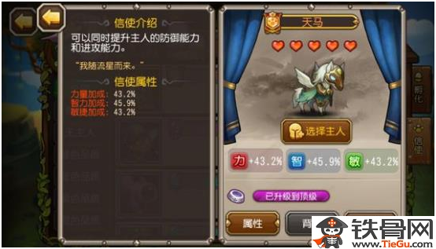

#Sky Horse (天馬)
Sky Horse is the only pet that is **orange** rank. Due to its ability to boost owner hero's stats and its own casting ability, Sky Horse is the most popular pet in Soul Hunters. However, it would work a lot better with the right heroes.

###Property
As the only orange-ranked pet, Sky Horse has an amazing stat increment: 
  * Strength: **+43.2%**
  * Intelligence: **+45.9%**
  * Agility: **+43.9%**

In general, any 5 stars hero with Sky Horse would have the similar stats of 7 stars hero. In other words, a hero with Sky Horse would receive roughly 25% stats growth for every star growth.

###Abilities

Sky Horse has two abilities.
  1. Holy Prayer:
      * passive ability
      * when HP of owner is lower or equal to 30%, Sky Horse gives a buff to its owner to increase not only physical and magical armor rating but also both attack rating
      * at ability level 40:
          * physical armor + 700
          * magical armor + 700
          * physical attack + 2773
          * magical attack + 3600
  2. Holy guardian:
      * active ability
      * when owner is casting ultimate, Sky Horse would grant a buff to owner
      * at ability level 40:
          * physical armor + 700
          * magical armor + 700
          * physical attack + 3169
          * magical attack + 3900

**Both abilities can be casted once per battle.**

###Conclusion
Which hero is a better match with Sky Horse? Here are three conditions that could help you to find the right hero:
  1. the hero which is in your **core** team and must be 5 stars (?)
  2. the hero should be a DPS and is able to keep contributing damages after ultimate
  3. (if not satisfying 2, then...) the hero that has good survival ability which allows hero to survive and do damages till the end of the battle. (or even be able to turn the battle around after his/her HP is low)

Here are some suggestions:

